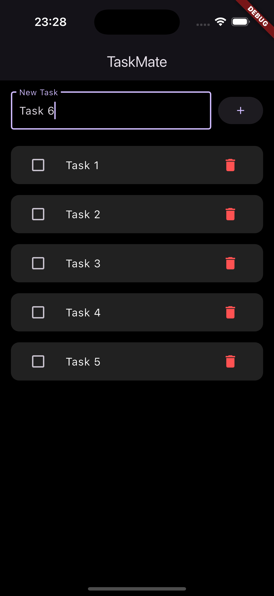
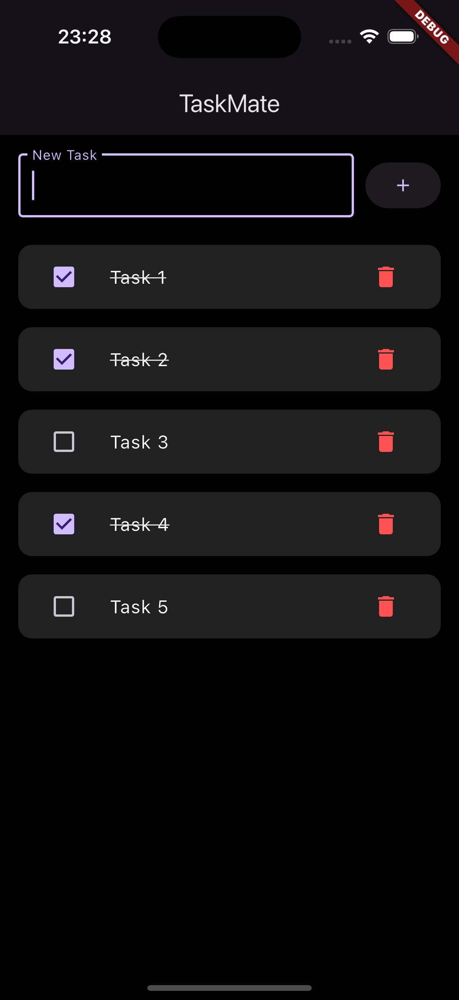

# 📝 TaskMate

A simple and elegant Flutter to-do list mobile app that helps you manage daily tasks efficiently. Designed with a clean dark UI and powered by `Provider` for state management, `TaskMate` stores your tasks locally using `shared_preferences`.

Screenshots

      

---

Features

- Add new tasks
- Toggle tasks as completed/incomplete
- Delete tasks
- Tasks saved locally (persistent storage)
- Responsive, dark-themed UI
- Built using Provider for state management

Tech Stack

- **Flutter**
- **Dart**
- `Provider` (state management)
- `Shared Preferences` (local storage)

